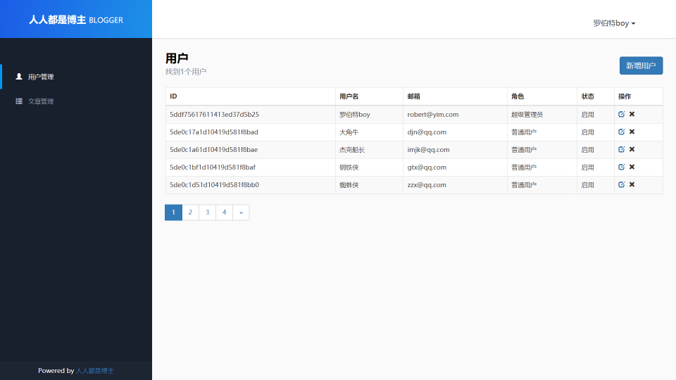
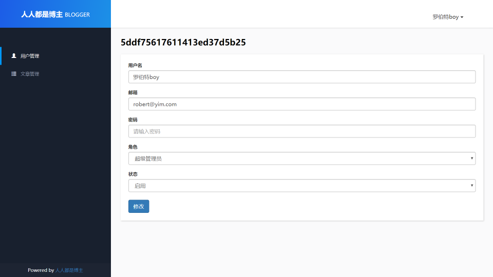
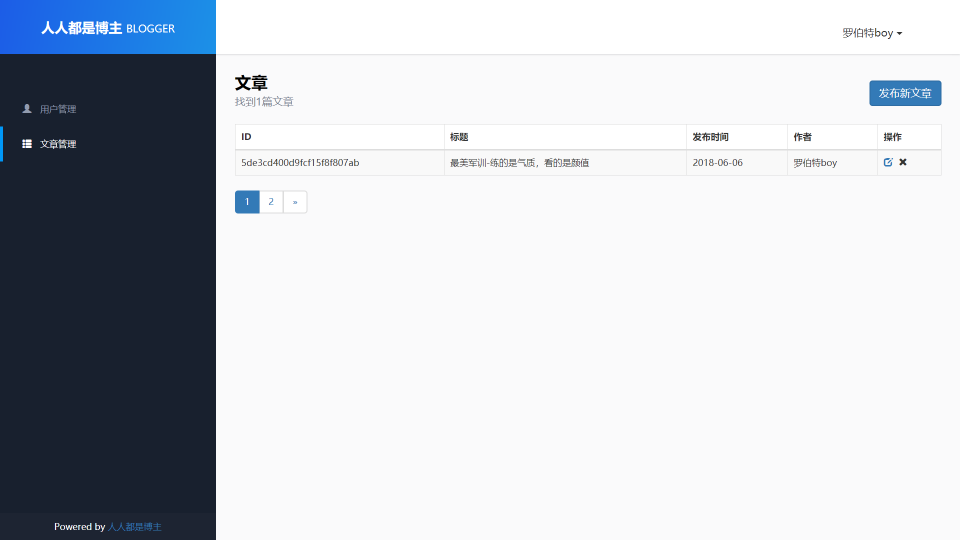
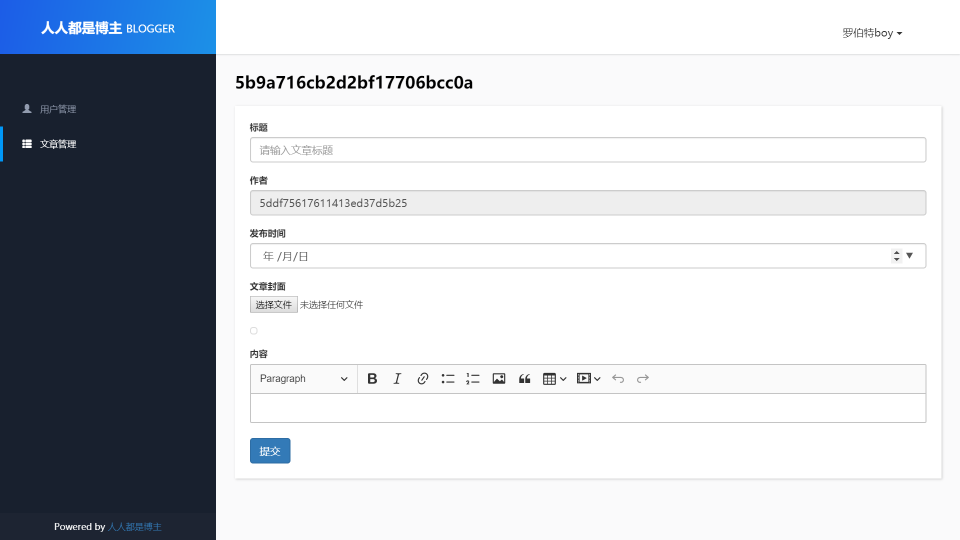

# 博客管理系统

## 登录页面

1. 保存登录状态，使用`express-session`第三方插件
2. 密码加密处理，使用 `bcrypt` 第三方插件

## 后台首页

1. 新增用户

2. 数据分页

   > 分页功能核心要素:

   - 当前页，用户通过点击上一页或者下一页或者页码产生，客户端通过get参数方式传递到服务器端

   - 总页数，根据总页数判断当前页是否为最后一页，根据判断结果做响应操作

   - | 总数据条数 | 每页显示数据条数 | 总页数 |
     | ---------- | ---------------- | ------ |
     | 50         | 10               | 5      |
     | 55         | 10               | 6      |

3. 用户信息修改

4. 用户信息删除

## 文章管理页面

1. 渲染文章管理页面

   - 使用第三方`dateForm`时间格式化插件，格式化时间

   - 使用集合关联查询，显示作者在用户列表中的名字

   - 使用第三方`mongoose-sex-page`插件，对页面进行分页
   
2. 发布文章
   

   - 给表单上传文件控件绑定一个监听事件，使用**javascript**内置的`FileReader()`读取图片文件，显示在发布文章页面
   - 使用第三方插件`formidable`,解析提交表单中的数据，并添加到文章集合中

3. 修改文章

4. 删除文章

## 博客首页

## 博客详情页

